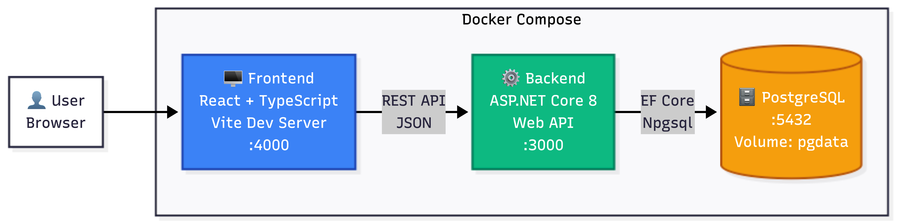
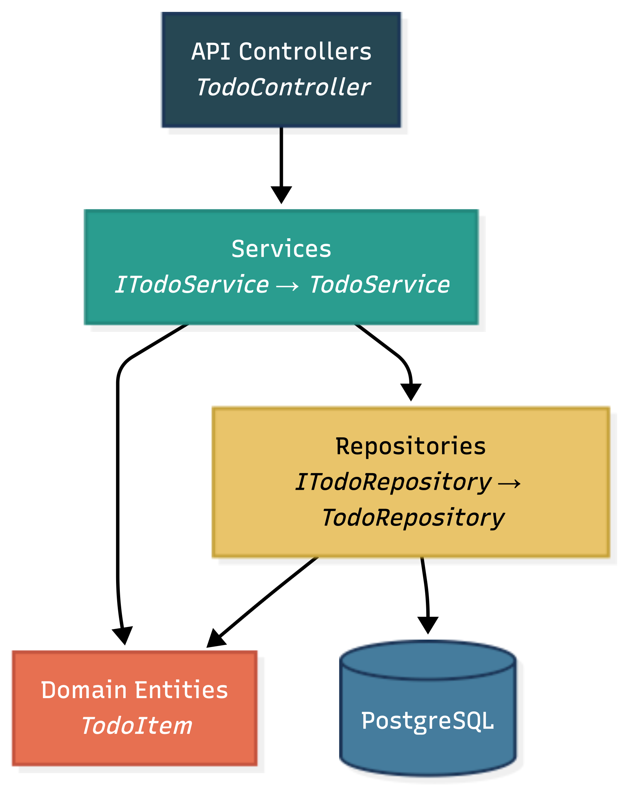

# ToDo Application

A full-stack ToDo app built with React + TypeScript, ASP.NET Core 8, and PostgreSQL, fully containerized with Docker Compose.

## Quick Start
1. Make sure your Docker Desktop app is running
2. Run the following command in the terminal from the root directory
3. Open the browser and go to http://localhost:4000
 ```bash
docker compose up --build -d
```

#### Ports
- **Frontend:** http://localhost:4000
- **Backend API:** http://localhost:3000/api/todos
- **Database:** PostgreSQL on port 5432

## Features

- Create tasks with a name (>10 characters) and optional deadline (date + time)
- View all tasks in a table with name, deadline, status, and actions
- Mark tasks as done (strikethrough) or undo
- Delete tasks with a confirmation dialog
- Overdue tasks highlighted in red (re-evaluated every 10 seconds, no network calls)
- Filter tasks: All / Active / Completed with item count
- Data persists across container restarts using a PostgreSQL database with a Docker-managed volume

## Project Structure

```
├── docker-compose.yml
├── backend/
│   ├── Dockerfile
│   ├── TodoApi.sln
│   └── TodoApi/          (Controllers, Services, Repositories, Models, Data)
└── frontend/
    ├── Dockerfile
    ├── package.json
    └── src/              (App, components, services, types)
```

## Tech Stack

- **Frontend:** React 18, TypeScript, Vite
- **Backend:** C# / ASP.NET Core 8, Entity Framework Core
- **Database:** PostgreSQL 16
- **Infrastructure:** Docker, Docker Compose

## Architecture

### System Container Diagram



### Backend Layer Dependency



## API Endpoints

| Method | Endpoint               | Description        |
|--------|------------------------|--------------------|
| GET    | /api/todos             | Get all tasks      |
| POST   | /api/todos             | Create a task      |
| PATCH  | /api/todos/{id}/toggle | Toggle done status |
| DELETE | /api/todos/{id}        | Delete a task      |

